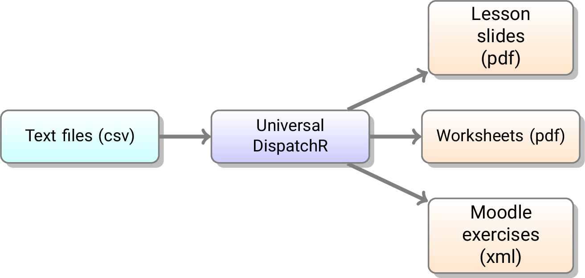

# UniversalDispatchR

This repository stores the input and output files of my R-based set of functions to generate pedagogical material (i.e. slides, worksheets and Moodle exercises).

This R-based set of functions, `UniversalDispatchR`, is **not** in the repository.

"worksheet.pdf", "worksheet-corrected.pdf" and "lesson.pdf" were created from the `.csv` files in the `pdfdata/` folder.

"MOODLE-EXERCISES.xml" was created using the `.csv` files in the `data/` folder.

These files showcase the different exercises that can be generated with `UniversalDispatchR`. 

The interactive Moodle exercises from "MOODLE-EXERCISES.xml" can be uploaded to a Moodle question bank, or tried on my website and its Moodle:

[englishforthefrench.com](https://englishforthefrench.com/moodle/)

**Login details:**

* id: tester
* pw: Super2024!!

Please use Firefox or Chrome, **not** Safari.
